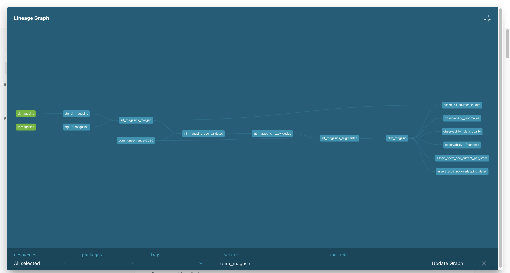
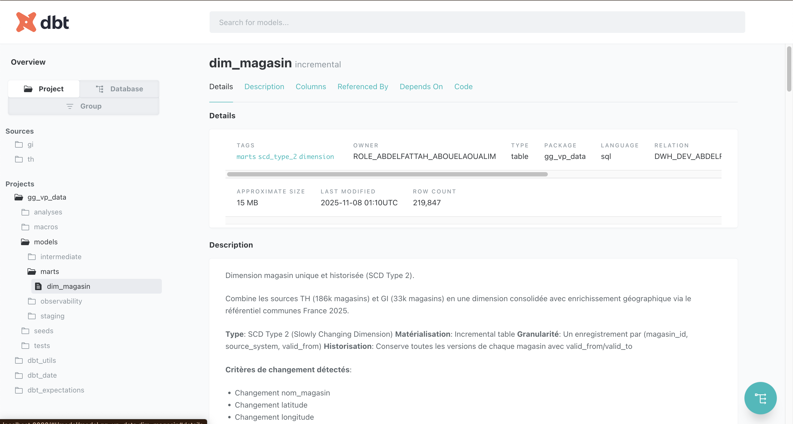

# Globe VP Data - Dimension Magasin Unique et Historisée

**Projet:** Consolidation multi-sources avec DataOps complet

**Stack:** dbt, Snowflake, Flyway, GitHub Actions

**Auteur:** Abdelfattah Abouelaoualim

**Dernière mise à jour:** 2025-11-09

---

## Table des Matières

1. [Vue d'ensemble](#vue-densemble)
2. [Architecture Technique](#architecture-technique)
3. [Politique de Gouvernance et Sécurité (RBAC)](#politique-de-gouvernance-et-sécurité-rbac)
4. [Gestion de la Qualité et Observabilité](#gestion-de-la-qualité-et-observabilité)
5. [Workflow CI/CD](#workflow-cicd)
6. [Principes de Priorisation et Planification Data](#principes-de-priorisation-et-planification-data)
7. [Guide de Démarrage Rapide](#guide-de-démarrage-rapide)
8. [Maintenance et Exploitation](#maintenance-et-exploitation)

---

## Vue d'ensemble

### Contexte Métier

L'entreprise dispose de **deux sources de données magasins** distinctes dans l'environnement Snowflake `DTL_EXO`:

- **TH.magasins**: 186,992 magasins (coordonnées GPS en FLOAT)
- **GI.magasins**: 33,841 magasins (coordonnées GPS en NUMBER)

Ces sources sont **mises à jour régulièrement** et contiennent des informations susceptibles de se recouper.

### Objectif du Projet

Construire une **dimension magasin unique et historisée** (SCD Type 2) dans le Data Warehouse avec:

1. **Consolidation** des deux sources en un référentiel unique
2. ⭐ **Validation GPS** : Correction automatique des coordonnées erronées via référentiel INSEE (80.9% stores avec anomalies)
3. ⭐ **Dédoublonnage** : Fuzzy matching intelligent (similarité nom + distance GPS) avec pré-filtrage par commune
4. **Enrichissement géographique** via le référentiel communes France 2025 (data.gouv.fr)
5. **Historisation** complète des changements (SCD Type 2)
6. **Workflow DataOps** automatisé (DEV → PROD avec validation)
7. **Gouvernance RBAC** stricte (principe du moindre privilège)
8. **Observabilité** et qualité des données intégrées

### Environnements Snowflake

| Environnement | Database | Usage | Accès |
|---------------|----------|-------|-------|
| **Source** | `DTL_EXO` | Tables brutes TH/GI | Read-only |
| **Développement** | `DWH_DEV_ABDELFATTAH` | Tests et itérations | Data Engineers (RW) |
| **Production** | `DWH_PROD_ABDELFATTAH` | Données validées | CI/CD only (via approval) |

---

## Architecture Technique

### Diagramme d'Architecture

```
┌─────────────────────────────────────────────────────────────────┐
│                         DTL_EXO (Sources)                       │
├──────────────────┬──────────────────────────────────────────────┤
│  TH.magasins     │  GI.magasins      │  (Read-only)             │
│  186,992 stores  │  33,841 stores    │                          │
└──────────────────┴──────────────────┬───────────────────────────┘
                                      │
                            ┌─────────▼────────────┐
                            │   dbt Staging Layer  │
                            │  stg_th_magasins     │
                            │  stg_gi_magasins     │
                            │  (+ quality flags)   │
                            └─────────┬────────────┘
                                      │
                            ┌─────────▼───────────────┐
                            │ dbt Intermediate        │
                            │ int_magasins_merged     │
                            │ int_magasins_geo_       │
                            │   validated (⭐ NEW)    │
                            │ int_magasins_fuzzy_     │
                            │   dedup                 │
                            │ int_magasins_augmented  │
                            │ (+ GPS correction +     │
                            │  deduplication)         │
                            └─────────┬───────────────┘
                                      │
                    ┌─────────────────▼──────────────-───┐
                    │       dbt Marts Layer              │
                    │    dim_magasin (SCD Type 2)        │
                    │  215,828 stores enrichis           │
                    │  valid_from | valid_to | is_current│
                    └─────────────────┬────────────────-─┘
                                      │
                            ┌─────────▼────────────┐
                            │  Observability Layer │
                            │  data_quality        │
                            │  freshness           │
                            │  anomalies           │
                            └──────────────────────┘
```

### Architecture DataOps

```
┌──────────────────────────────────────────────────────────────────┐
│                     Developer Workflow                           │
└───────────────────────────┬──────────────────────────────────────┘
                            │
                   ┌────────▼────────┐
                   │  Feature Branch │
                   │  (Git)          │
                   └────────┬────────┘
                            │
                   ┌────────▼────────┐
                   │  Pull Request   │
                   │  to develop     │
                   └────────┬────────┘
                            │
        ┌───────────────────▼───────────────────┐
        │     GitHub Actions CI/CD              │
        ├───────────────────────────────────────┤
        │  1. Lint (sqlfluff)                   │
        │  2. Test on DEV (dbt test)            │
        │  3. Merge to develop → Auto deploy DEV│
        └───────────────────┬───────────────────┘
                            │
                   ┌────────▼────────┐
                   │  Merge develop  │
                   │  to main        │
                   └────────┬────────┘
                            │
        ┌───────────────────▼───────────────────┐
        │  GitHub Actions - PROD Deployment     │
        ├───────────────────────────────────────┤
        │  1. Flyway Migrations (DDL)           │
        │  2. Manual Approval Required ✋       │
        │  3. dbt run --target prod             │
        │  4. dbt test --target prod --fail-fast│
        └───────────────────┬───────────────────┘
                            │
                   ┌────────▼────────┐
                   │  DWH_PROD       │
                   │  (Production)   │
                   └─────────────────┘
```

### Stack Technologique

| Composant | Technologie | Rôle |
|-----------|-------------|------|
| **Transformation** | dbt 1.10.13 | ELT, modélisation dimensionnelle |
| **Data Warehouse** | Snowflake | Stockage et compute |
| **DDL Migrations** | Flyway | Versionnement schémas, RBAC |
| **CI/CD** | GitHub Actions | Automatisation lint/test/deploy |
| **Versioning** | Git | Contrôle de version, branches |
| **Linting** | sqlfluff | Validation syntaxe SQL |
| **Tests** | dbt tests + dbt_expectations | Qualité données |

### Structure du Projet

```
gg_vp_data/
├── .github/
│   └── workflows/
│       └── ci_cd.yml              # Pipeline CI/CD complet (lint → test → deploy)
│
├── dbt_project.yml                # Configuration dbt (matérialisations, schémas)
├── packages.yml                   # Dépendances (dbt_utils, dbt_expectations)
│
├── flyway/                        # Migrations DDL versionnées (RBAC + schémas)
│   ├── flyway.conf                # Config Flyway (connexion Snowflake)
│   └── sql/
│       ├── V001__create_databases_schemas.sql
│       ├── V002__create_warehouses.sql
│       ├── V003__create_roles.sql
│       └── V004__grant_permissions.sql
│
├── models/                        # Modèles dbt (transformations SQL)
│   ├── sources.yml                # Déclaration sources + freshness monitoring
│   │
│   ├── staging/                   # Couche 1: Nettoyage + typage
│   │   ├── staging.yml            # Tests sources
│   │   ├── stg_th_magasins.sql    # Source TH (186k stores)
│   │   └── stg_gi_magasins.sql    # Source GI (34k stores)
│   │
│   ├── intermediate/              # Couche 2: Transformations métier
│   │   ├── intermediate.yml       # Tests intermédiaires
│   │   ├── int_magasins_merged.sql          # Union TH + GI
│   │   ├── int_magasins_geo_validated.sql   # ⭐ GPS validation INSEE
│   │   ├── int_magasins_fuzzy_dedup.sql     # ⭐ Dédoublonnage fuzzy
│   │   └── int_magasins_augmented.sql       # Enrichissement géo
│   │
│   ├── marts/                     # Couche 3: Tables exposées (dimensions/faits)
│   │   ├── marts.yml              # Tests + documentation SCD2
│   │   └── dim_magasin.sql        # Dimension magasin (SCD Type 2)
│   │
│   └── observability/             # Métriques qualité données
│       ├── observability.yml      # Tests observabilité
│       ├── observability__data_quality.sql   # Complétude, cohérence
│       ├── observability__freshness.sql      # SLA fraîcheur <24h
│       └── observability__anomalies.sql      # Détection anomalies
│
├── macros/                        # Fonctions SQL réutilisables (Jinja)
│   ├── haversine_distance.sql     # Distance GPS (formule Haversine)
│   ├── text_similarity.sql        # Similarité texte (EDITDISTANCE normalisé)
│   ├── extract_city_from_name.sql # ⭐ Extraction ville par regex
│   ├── generate_schema_name.sql   # Override schéma naming dbt
│   ├── drop_table.sql             # Utility drop table safe
│   └── show_tables.sql            # Utility list tables
│
├── analyses/                      # Requêtes SQL ad-hoc (analytics exploratoires)
│   ├── dedup_metrics.sql          # ⭐ Métriques dédoublonnage (golden records)
│   ├── gps_correction_impact.sql  # ⭐ Impact correction GPS INSEE
│   └── query_results.sql          # ⭐ Résultats aggregés finaux
│
├── tests/                         # Tests custom métier (dbt singular tests)
│   ├── assert_scd2_one_current_per_store.sql  # Unicité is_current=TRUE
│   ├── assert_all_sources_in_dim.sql          # Exhaustivité TH+GI→dim
│   └── assert_scd2_no_overlapping_dates.sql   # Intégrité périodes SCD2
│
├── seeds/                         # Données référentielles (CSV statiques)
│   ├── communes-france-2025.csv   # Référentiel INSEE (34k communes, 2MB)
│   └── communes-france-2025.yml   # Config + tests seed
│
├── docs/                          # Documentation architecture & décisions
│   ├── README.md                  # Index documentation (parcours utilisateurs)
│   ├── FAQ.md                     # 40+ questions/réponses
│   ├── ADR-001-scd-type-2.md      # Décision SCD Type 2
│   ├── ADR-002-matching-strategy.md # Décision matching fuzzy
│   ├── ADR-003-deduplication-fuzzy-matching.md  # Algorithme dédoublonnage
│   ├── ADR-004-gps-validation-correction.md     # ⭐ Validation GPS INSEE
│   ├── ROADMAP.md                 # Évolutions futures
│   └── AUDIT_DOCUMENTATION.md     # Bilan audit documentation
│
├── images/                        # Captures d'écran dbt docs
│   ├── lineage.png                # Graphe dépendances modèles
│   └── details.png                # Détails table dim_magasin
│
├── CHANGELOG.md                   # Historique versions (Keep a Changelog)
└── README.md                      # 👈 Ce fichier (guide complet)
```

**Légende** :
- 📁 **staging** : Nettoyage sources (typage, normalisation)
- 🔧 **intermediate** : Transformations métier (GPS, dedup, enrichissement)
- 📊 **marts** : Tables exposées (dimensions/faits pour BI)
- 🔍 **observability** : Métriques qualité temps réel
- ⭐ **NEW** : Ajouté dans version 1.2.0 (2025-11-08)

### Modèle de Données

#### SCD Type 2: dim_magasin

**Clé primaire:** `magasin_key` (MD5 surrogate key)
**Clé métier:** `(magasin_id, source_system)`
**Granularité:** Un enregistrement par version de magasin

| Colonne | Type | Description | SCD |
|---------|------|-------------|-----|
| `magasin_key` | VARCHAR | Clé surrogate unique | - |
| `magasin_id` | NUMBER | ID métier du magasin | Business key |
| `nom_magasin` | VARCHAR | Nom du magasin | Tracked |
| `latitude` | FLOAT | Latitude GPS (WGS84) | Tracked |
| `longitude` | FLOAT | Longitude GPS (WGS84) | Tracked |
| `source_system` | VARCHAR | 'TH' ou 'GI' | Business key |
| `commune_nom` | VARCHAR | Commune enrichie | - |
| `code_postal` | VARCHAR | Code postal | - |
| `dep_nom` | VARCHAR | Département | - |
| `reg_nom` | VARCHAR | Région | - |
| `coords_dans_plage_france` | BOOLEAN | GPS dans plage France | Tracked |
| `match_fiable` | BOOLEAN | Matching fiable (>70% sim, <50km) | - |
| `coords_correction_requise` | BOOLEAN | Distance > 50km | - |
| **`valid_from`** | **TIMESTAMP** | **Date début validité** | **SCD** |
| **`valid_to`** | **TIMESTAMP** | **Date fin validité (NULL si current)** | **SCD** |
| **`is_current`** | **BOOLEAN** | **TRUE = version actuelle** | **SCD** |

**Critères de détection de changement:**
- Nom du magasin change
- Latitude change
- Longitude change
- Flag `coords_dans_plage_france` change

---

## Politique de Gouvernance et Sécurité (RBAC)

### Principes de Sécurité

1. **Least Privilege (Moindre Privilège)**
   - Chaque rôle a le minimum de permissions nécessaires
   - Séparation lecture/écriture stricte
   - Pas d'accès direct PROD pour les humains

2. **Separation of Duties (Séparation des Responsabilités)**
   - Flyway = DDL (CREATE, ALTER, DROP)
   - dbt = DML (INSERT, UPDATE, DELETE via transformations)
   - Analystes = Lecture seule (SELECT)

3. **Defense in Depth (Défense en Profondeur)**
   - Isolation par warehouse
   - Permissions par schéma
   - Permissions par table
   - FUTURE GRANTS pour nouveaux objets

4. **Audit Trail (Traçabilité)**
   - GitHub Actions logs toutes les actions CI/CD
   - Snowflake QUERY_HISTORY track toutes les requêtes
   - Flyway track toutes les migrations DDL

### Rôles et Permissions

#### Rôles Fonctionnels (Humains)

| Rôle | Profil | Accès Warehouses | Accès Schémas | Privilèges |
|------|--------|------------------|---------------|------------|
| **DATA_ENGINEER** | Ingénieurs data | TRANSFORM_WH, ANALYTICS_WH, ADMIN_WH | DEV: ALL, PROD: READ | CREATE, ALTER, DROP (DEV only), SELECT |
| **DATA_ANALYST** | Analystes métier | ANALYTICS_WH | marts, observability (RO) | SELECT |
| **PRODUCT_OWNER** | Product Owners | ANALYTICS_WH | marts, observability (RO) | SELECT |
| **CLIENT_VIEWER** | Clients externes | CLIENT_WH | marts (RO) - vues limitées | SELECT (avec row-level security future) |

#### Rôles Techniques (Service Accounts)

| Rôle | Usage | Accès Warehouses | Privilèges |
|------|-------|------------------|------------|
| **DBT_RUNNER** | Transformations dbt | TRANSFORM_WH | CREATE, INSERT, UPDATE, DELETE (staging, intermediate, marts) |
| **FLYWAY_DEPLOYER** | Migrations DDL | ADMIN_WH | CREATE SCHEMA, ALTER, DROP, GRANT |
| **CICD_PIPELINE** | GitHub Actions | TRANSFORM_WH, ADMIN_WH | Hérite DBT_RUNNER + FLYWAY_DEPLOYER |

**C'est quoi ?**

Les **Service Accounts** (comptes techniques) sont des **utilisateurs non-humains** créés spécifiquement pour l'automatisation. Contrairement aux comptes personnels (`alice_analyst`, `bob_engineer`), ils sont utilisés par des **systèmes automatisés** (CI/CD, orchestrateurs, scripts).

**Caractéristiques** :
- ❌ Pas de login interactif humain
- ✅ Identifiants stockés dans secrets management (GitHub Secrets, Vault)
- ✅ Permissions minimales strictes (principe du moindre privilège)
- ✅ Traçabilité complète via logs Snowflake QUERY_HISTORY

**Pourquoi faire ?**

1. **Sécurité** :
   - Éviter de partager credentials personnels dans CI/CD
   - Rotation facile des mots de passe (sans impacter développeurs)
   - Audit trail clair : `github_actions_bot` vs `bob_engineer`

2. **Séparation des responsabilités** :
   - `DBT_RUNNER` = Transformations DML uniquement
   - `FLYWAY_DEPLOYER` = Migrations DDL uniquement
   - `CICD_PIPELINE` = Orchestration (hérite les 2)

3. **Reproductibilité** :
   - Déploiements identiques en DEV/PROD
   - Pas de dépendance à un développeur spécifique

**Comment ?**

**1. Création du Service Account dans Snowflake :**
```sql
-- Créer utilisateur technique
CREATE USER github_actions_bot
  PASSWORD = 'SECURE_RANDOM_PASSWORD_32_CHARS'
  DEFAULT_ROLE = CICD_PIPELINE
  COMMENT = 'Service account for GitHub Actions CI/CD';

-- Assigner rôle
GRANT ROLE CICD_PIPELINE TO USER github_actions_bot;

-- Désactiver login interactif (optionnel mais recommandé)
ALTER USER github_actions_bot SET MUST_CHANGE_PASSWORD = FALSE;
```

**2. Configuration dans GitHub Actions :**
```yaml
# .github/workflows/ci_cd.yml
jobs:
  deploy-prod:
    steps:
      - name: dbt run
        env:
          SNOWFLAKE_USER: ${{ secrets.SNOWFLAKE_PROD_USER }}      # = github_actions_bot
          SNOWFLAKE_PASSWORD: ${{ secrets.SNOWFLAKE_PROD_PASSWORD }}
          SNOWFLAKE_ROLE: CICD_PIPELINE
        run: dbt run --target prod
```

**3. Traçabilité :**
```sql
-- Vérifier actions du service account
SELECT
  query_text,
  user_name,
  role_name,
  execution_status,
  start_time
FROM SNOWFLAKE.ACCOUNT_USAGE.QUERY_HISTORY
WHERE user_name = 'GITHUB_ACTIONS_BOT'
  AND start_time > DATEADD(day, -7, CURRENT_TIMESTAMP())
ORDER BY start_time DESC;
```

#### Hiérarchie des Rôles

```
ACCOUNTADMIN
    ├── SYSADMIN
    │   ├── DATA_ENGINEER
    │   │   ├── DATA_ANALYST
    │   │   └── DBT_RUNNER
    │   ├── PRODUCT_OWNER
    │   ├── CLIENT_VIEWER
    │   ├── FLYWAY_DEPLOYER
    │   └── CICD_PIPELINE
    │       ├── DBT_RUNNER (hérité)
    │       └── FLYWAY_DEPLOYER (hérité)
    └── SECURITYADMIN
```

### Warehouses Dédiés

| Warehouse | Taille | Auto-Suspend | Usage | Rôles Autorisés |
|-----------|--------|--------------|-------|-----------------|
| **TRANSFORM_WH** | MEDIUM | 60s | dbt transformations ETL | DATA_ENGINEER, DBT_RUNNER, CICD_PIPELINE |
| **ANALYTICS_WH** | SMALL | 120s | Requêtes analystes, reporting | DATA_ENGINEER, DATA_ANALYST, PRODUCT_OWNER |
| **CLIENT_WH** | XSMALL | 180s | Accès clients externes (RO) | CLIENT_VIEWER |
| **ADMIN_WH** | XSMALL | 300s | Tâches admin, Flyway migrations | DATA_ENGINEER, FLYWAY_DEPLOYER, CICD_PIPELINE |

**C'est quoi ?**

Les **Warehouses** (entrepôts de calcul) dans Snowflake sont des **clusters de compute séparés** qui exécutent les requêtes. Chaque warehouse est **isolé** et possède ses propres ressources CPU/mémoire. C'est l'équivalent d'un "moteur de requêtes" dédié.

**Caractéristiques** :
- ✅ **Isolation totale** : Un warehouse surchargé n'impacte pas les autres
- ✅ **Facturation séparée** : Coûts trackables par usage (ETL vs Analytics vs Admin)
- ✅ **Auto-suspend** : Arrêt automatique après inactivité (économies)
- ✅ **Tailles variables** : XSMALL → 4X-LARGE (scaling vertical)

**Pourquoi faire ?**

1. **Isolation des charges de travail** :
   - ETL lourd (dbt CROSS JOIN) sur `TRANSFORM_WH` → N'impacte pas analystes sur `ANALYTICS_WH`
   - Dashboard client lent → N'impacte pas production sur `TRANSFORM_WH`

2. **Optimisation des coûts** :
   - `ANALYTICS_WH` (SMALL, 120s) : Usage sporadique analystes → Suspend rapidement
   - `TRANSFORM_WH` (MEDIUM, 60s) : ETL intensif → Plus de compute, suspend vite
   - `CLIENT_WH` (XSMALL, 180s) : Lectures simples → Minimal compute, suspend lentement

3. **Sécurité et traçabilité** :
   - Logs Snowflake montrent quel rôle utilise quel warehouse
   - Détection anomalies (ex: `CLIENT_VIEWER` utilise `ADMIN_WH` = alerte sécurité)

4. **Performance prévisible** :
   - Analystes ont ressources garanties (pas de contention avec ETL)

**Comment ?**

**1. Création des Warehouses dans Snowflake :**
```sql
-- Warehouse pour transformations dbt
CREATE WAREHOUSE TRANSFORM_WH
  WAREHOUSE_SIZE = 'MEDIUM'
  AUTO_SUSPEND = 60
  AUTO_RESUME = TRUE
  INITIALLY_SUSPENDED = TRUE
  COMMENT = 'Dedicated compute for dbt ETL transformations';

-- Warehouse pour analystes
CREATE WAREHOUSE ANALYTICS_WH
  WAREHOUSE_SIZE = 'SMALL'
  AUTO_SUSPEND = 120
  AUTO_RESUME = TRUE
  INITIALLY_SUSPENDED = TRUE
  COMMENT = 'Dedicated compute for analyst queries and reporting';

-- Warehouse pour clients (read-only)
CREATE WAREHOUSE CLIENT_WH
  WAREHOUSE_SIZE = 'XSMALL'
  AUTO_SUSPEND = 180
  AUTO_RESUME = TRUE
  INITIALLY_SUSPENDED = TRUE
  COMMENT = 'Dedicated compute for external client access';

-- Warehouse pour admin
CREATE WAREHOUSE ADMIN_WH
  WAREHOUSE_SIZE = 'XSMALL'
  AUTO_SUSPEND = 300
  AUTO_RESUME = TRUE
  INITIALLY_SUSPENDED = TRUE
  COMMENT = 'Dedicated compute for admin tasks and Flyway migrations';
```

**2. Attribution des Permissions :**
```sql
-- DATA_ENGINEER peut utiliser TRANSFORM_WH et ANALYTICS_WH
GRANT USAGE ON WAREHOUSE TRANSFORM_WH TO ROLE DATA_ENGINEER;
GRANT USAGE ON WAREHOUSE ANALYTICS_WH TO ROLE DATA_ENGINEER;

-- DBT_RUNNER (CI/CD) uniquement TRANSFORM_WH
GRANT USAGE ON WAREHOUSE TRANSFORM_WH TO ROLE DBT_RUNNER;

-- DATA_ANALYST uniquement ANALYTICS_WH
GRANT USAGE ON WAREHOUSE ANALYTICS_WH TO ROLE DATA_ANALYST;
```

**3. Utilisation dans dbt profiles.yml :**
```yaml
gg_vp_data:
  outputs:
    dev:
      warehouse: TRANSFORM_WH  # ← Spécifie quel warehouse utiliser
    prod:
      warehouse: TRANSFORM_WH
```

**4. Monitoring des Coûts :**
```sql
-- Coût par warehouse (derniers 7 jours)
SELECT
  warehouse_name,
  SUM(credits_used) AS total_credits,
  SUM(credits_used) * 3.0 AS estimated_cost_usd  -- Tarif approximatif Snowflake
FROM SNOWFLAKE.ACCOUNT_USAGE.WAREHOUSE_METERING_HISTORY
WHERE start_time > DATEADD(day, -7, CURRENT_TIMESTAMP())
GROUP BY warehouse_name
ORDER BY total_credits DESC;
```

**Résultat Monitoring (exemple)** :
| Warehouse | Credits (7j) | Coût Estimé | Utilisation |
|-----------|--------------|-------------|-------------|
| TRANSFORM_WH | 12.5 | $37.50 | ETL quotidien (dbt run ~20 min/jour) |
| ANALYTICS_WH | 2.3 | $6.90 | Requêtes analystes (sporadique) |
| ADMIN_WH | 0.8 | $2.40 | Migrations Flyway (rare) |
| CLIENT_WH | 0.1 | $0.30 | Dashboards clients (faible usage) |

### Matrice d'Accès Détaillée

#### DEV Environment (DWH_DEV_ABDELFATTAH)

| Schéma | DATA_ENGINEER | DATA_ANALYST | DBT_RUNNER | FLYWAY_DEPLOYER |
|--------|---------------|--------------|------------|-----------------|
| staging | ALL | - | ALL | ALL |
| intermediate | ALL | - | ALL | ALL |
| marts | ALL | SELECT | ALL | ALL |
| observability | ALL | SELECT | SELECT | ALL |

#### PROD Environment (DWH_PROD_ABDELFATTAH)

| Schéma | DATA_ENGINEER | DATA_ANALYST | PRODUCT_OWNER | CLIENT_VIEWER | DBT_RUNNER | FLYWAY_DEPLOYER |
|--------|---------------|--------------|---------------|---------------|------------|-----------------|
| staging | SELECT | - | - | - | ALL (via CI/CD) | ALL |
| intermediate | SELECT | - | - | - | ALL (via CI/CD) | ALL |
| marts | SELECT | SELECT | SELECT | SELECT | ALL (via CI/CD) | ALL |
| observability | SELECT | SELECT | SELECT | - | SELECT | ALL |

**⚠️ Point Critique:** Aucun humain n'a d'accès écriture direct en PROD. Tous les déploiements passent par CI/CD avec approbation manuelle.

**C'est quoi ?**

La **Matrice d'Accès** est un tableau de référence qui spécifie **exactement** qui peut faire quoi sur chaque schéma dans chaque environnement. C'est le contrat de sécurité du projet.

**Principes** :
- ✅ **Least Privilege** : Minimum requis pour accomplir sa mission
- ✅ **Separation of Duties** : Rôles techniques vs fonctionnels séparés
- ✅ **Environment Isolation** : DEV = permissif, PROD = restrictif
- ✅ **Zero Trust** : Aucun accès par défaut, tout doit être explicite

**Comment c'est assuré ?**

L'assurance de cette matrice repose sur **4 niveaux de contrôle** :

**1. Contrôle au Déploiement (Flyway Migrations Versionnées)**

Toutes les permissions sont définies dans des migrations SQL versionnées et auditables :

```sql
-- flyway/sql/V004__grant_permissions.sql

-- ============================================
-- DEV ENVIRONMENT: Permissions permissives
-- ============================================

-- DATA_ENGINEER: Full access en DEV
GRANT ALL ON SCHEMA DWH_DEV_ABDELFATTAH.staging TO ROLE DATA_ENGINEER;
GRANT ALL ON SCHEMA DWH_DEV_ABDELFATTAH.intermediate TO ROLE DATA_ENGINEER;
GRANT ALL ON SCHEMA DWH_DEV_ABDELFATTAH.marts TO ROLE DATA_ENGINEER;

-- DATA_ANALYST: Read-only marts en DEV
GRANT USAGE ON SCHEMA DWH_DEV_ABDELFATTAH.marts TO ROLE DATA_ANALYST;
GRANT SELECT ON ALL TABLES IN SCHEMA DWH_DEV_ABDELFATTAH.marts TO ROLE DATA_ANALYST;
GRANT SELECT ON FUTURE TABLES IN SCHEMA DWH_DEV_ABDELFATTAH.marts TO ROLE DATA_ANALYST;

-- ============================================
-- PROD ENVIRONMENT: Permissions restrictives
-- ============================================

-- DATA_ENGINEER: READ-ONLY en PROD (pas de write direct!)
GRANT USAGE ON SCHEMA DWH_PROD_ABDELFATTAH.staging TO ROLE DATA_ENGINEER;
GRANT SELECT ON ALL TABLES IN SCHEMA DWH_PROD_ABDELFATTAH.staging TO ROLE DATA_ENGINEER;

GRANT USAGE ON SCHEMA DWH_PROD_ABDELFATTAH.marts TO ROLE DATA_ENGINEER;
GRANT SELECT ON ALL TABLES IN SCHEMA DWH_PROD_ABDELFATTAH.marts TO ROLE DATA_ENGINEER;

-- DBT_RUNNER: Full write access (via CI/CD uniquement)
GRANT ALL ON SCHEMA DWH_PROD_ABDELFATTAH.staging TO ROLE DBT_RUNNER;
GRANT ALL ON SCHEMA DWH_PROD_ABDELFATTAH.intermediate TO ROLE DBT_RUNNER;
GRANT ALL ON SCHEMA DWH_PROD_ABDELFATTAH.marts TO ROLE DBT_RUNNER;

-- Assurer que les futures tables héritent des permissions
GRANT SELECT ON FUTURE TABLES IN SCHEMA DWH_PROD_ABDELFATTAH.marts TO ROLE DATA_ANALYST;
```

**Avantages Flyway** :
- ✅ Versionnage Git (audit trail complet)
- ✅ Idempotence (re-run safe)
- ✅ Rollback possible (si Flyway Teams)
- ✅ Validation CI/CD avant déploiement

**2. Contrôle à l'Exécution (Snowflake RBAC Natif)**

Snowflake enforce les permissions au niveau système :

```sql
-- Vérifier permissions effectives d'un rôle
SHOW GRANTS TO ROLE DATA_ENGINEER;
```

Exemple sortie:

| privilege | granted_on | name | granted_to | granted_by |
|-----------|------------|------|------------|------------|
| ALL       | SCHEMA     | DWH_DEV_ABDELFATTAH.staging | ROLE DATA_ENGINEER | SECURITYADMIN |
| SELECT    | SCHEMA     | DWH_PROD_ABDELFATTAH.marts  | ROLE DATA_ENGINEER | SECURITYADMIN |


**3. Contrôle d'Authentification (Service Accounts Dédiés)**

En PROD, **seuls les service accounts** peuvent modifier les données :

```yaml
# .github/workflows/ci_cd.yml (PROD deployment)
deploy-prod:
  environment: production  # ← Requiert approval manuelle
  steps:
    - name: dbt run PROD
      env:
        SNOWFLAKE_USER: ${{ secrets.SNOWFLAKE_PROD_USER }}      # = github_actions_bot
        SNOWFLAKE_PASSWORD: ${{ secrets.SNOWFLAKE_PROD_PASSWORD }}
        SNOWFLAKE_ROLE: DBT_RUNNER  # ← Pas DATA_ENGINEER!
```

**Humains en PROD** :
```bash
# Bob (DATA_ENGINEER) se connecte en PROD
snowsql -a ACCOUNT -u bob_engineer -r DATA_ENGINEER

# Tentative modification → ÉCHOUE
bob_engineer@DWH_PROD> DELETE FROM marts.dim_magasin WHERE is_current = FALSE;
-- ❌ SQL access control error: Insufficient privileges to operate on table 'DIM_MAGASIN'
```

**4. Contrôle Post-Déploiement (Tests Automatisés)**

Tests dbt vérifient l'intégrité des permissions :

```sql
-- tests/assert_prod_permissions_read_only.sql (custom test)
-- Vérifier qu'aucun humain n'a de privilège write en PROD

SELECT
  r.name AS role_name,
  p.privilege
FROM SNOWFLAKE.ACCOUNT_USAGE.GRANTS_TO_ROLES p
JOIN SNOWFLAKE.ACCOUNT_USAGE.ROLES r ON p.grantee_name = r.name
WHERE p.table_schema LIKE 'DWH_PROD%'
  AND p.privilege IN ('INSERT', 'UPDATE', 'DELETE', 'TRUNCATE')
  AND r.name NOT IN ('DBT_RUNNER', 'FLYWAY_DEPLOYER', 'CICD_PIPELINE')  -- Exclus service accounts
HAVING COUNT(*) > 0;  -- ❌ Test échoue si résultat non vide
```

**Audit Continu** :
```sql
-- Qui a modifié quoi en PROD (dernières 24h)
SELECT
  user_name,
  role_name,
  query_type,
  query_text,
  execution_status,
  start_time
FROM SNOWFLAKE.ACCOUNT_USAGE.QUERY_HISTORY
WHERE database_name = 'DWH_PROD_ABDELFATTAH'
  AND query_type IN ('INSERT', 'UPDATE', 'DELETE', 'MERGE')
  AND start_time > DATEADD(hour, -24, CURRENT_TIMESTAMP())
ORDER BY start_time DESC;
```

**Résumé des Assurances** :

| Niveau | Mécanisme | Fréquence | Responsable |
|--------|-----------|-----------|-------------|
| **Déploiement** | Flyway migrations SQL | À chaque deploy | CICD_PIPELINE |
| **Runtime** | Snowflake RBAC natif | Chaque requête | Snowflake |
| **Authentification** | Service accounts (PROD) | Chaque connexion | GitHub Actions |
| **Audit** | Tests dbt + QUERY_HISTORY | Post-deploy + continu | Data Engineers |

### Implémentation RBAC

Les rôles et permissions sont créés via **Flyway migrations versionnées**. Voici un exemple **complet et réaliste** couvrant tout le cycle de vie RBAC.

#### Étape 1: Création de la Hiérarchie de Rôles

```sql
-- flyway/sql/V003__create_roles.sql
-- Exécuté par: SECURITYADMIN (via Flyway ADMIN_WH)
-- Date: 2025-01-15 (Version 1.0 du projet)

USE ROLE SECURITYADMIN;

-- ============================================
-- RÔLES FONCTIONNELS (Humains)
-- ============================================

-- Rôle pour ingénieurs data (full access DEV, read-only PROD)
CREATE ROLE IF NOT EXISTS DATA_ENGINEER
  COMMENT = 'Data engineers with dev access and prod read-only';

-- Rôle pour analystes métier (read-only marts uniquement)
CREATE ROLE IF NOT EXISTS DATA_ANALYST
  COMMENT = 'Business analysts with read-only access to marts layer';

-- Rôle pour product owners (read-only marts + observability)
CREATE ROLE IF NOT EXISTS PRODUCT_OWNER
  COMMENT = 'Product owners with read-only access to marts and observability';

-- Rôle pour clients externes (read-only marts via vues filtrées)
CREATE ROLE IF NOT EXISTS CLIENT_VIEWER
  COMMENT = 'External clients with restricted read-only access';

-- ============================================
-- RÔLES TECHNIQUES (Service Accounts)
-- ============================================

-- Rôle pour exécution dbt (transformations DML)
CREATE ROLE IF NOT EXISTS DBT_RUNNER
  COMMENT = 'Service account for dbt transformations (DML only)';

-- Rôle pour déploiements Flyway (migrations DDL)
CREATE ROLE IF NOT EXISTS FLYWAY_DEPLOYER
  COMMENT = 'Service account for Flyway migrations (DDL only)';

-- Rôle CI/CD qui hérite DBT_RUNNER + FLYWAY_DEPLOYER
CREATE ROLE IF NOT EXISTS CICD_PIPELINE
  COMMENT = 'GitHub Actions service account (orchestration)';

-- ============================================
-- HIÉRARCHIE DES RÔLES
-- ============================================

-- DATA_ANALYST hérite par DATA_ENGINEER (engineers peuvent tester en tant qu'analyst)
GRANT ROLE DATA_ANALYST TO ROLE DATA_ENGINEER;

-- CICD_PIPELINE hérite DBT_RUNNER + FLYWAY_DEPLOYER
GRANT ROLE DBT_RUNNER TO ROLE CICD_PIPELINE;
GRANT ROLE FLYWAY_DEPLOYER TO ROLE CICD_PIPELINE;

-- Tous les rôles héritent par SYSADMIN (pour gestion centralisée)
GRANT ROLE DATA_ENGINEER TO ROLE SYSADMIN;
GRANT ROLE DATA_ANALYST TO ROLE SYSADMIN;
GRANT ROLE PRODUCT_OWNER TO ROLE SYSADMIN;
GRANT ROLE CLIENT_VIEWER TO ROLE SYSADMIN;
GRANT ROLE DBT_RUNNER TO ROLE SYSADMIN;
GRANT ROLE FLYWAY_DEPLOYER TO ROLE SYSADMIN;
GRANT ROLE CICD_PIPELINE TO ROLE SYSADMIN;
```

#### Étape 2: Attribution des Permissions sur Warehouses

```sql
-- flyway/sql/V004__grant_warehouse_permissions.sql

USE ROLE SECURITYADMIN;

-- ============================================
-- TRANSFORM_WH (ETL dbt)
-- ============================================
GRANT USAGE ON WAREHOUSE TRANSFORM_WH TO ROLE DATA_ENGINEER;
GRANT USAGE ON WAREHOUSE TRANSFORM_WH TO ROLE DBT_RUNNER;
GRANT USAGE ON WAREHOUSE TRANSFORM_WH TO ROLE CICD_PIPELINE;

-- ============================================
-- ANALYTICS_WH (Requêtes analystes)
-- ============================================
GRANT USAGE ON WAREHOUSE ANALYTICS_WH TO ROLE DATA_ENGINEER;
GRANT USAGE ON WAREHOUSE ANALYTICS_WH TO ROLE DATA_ANALYST;
GRANT USAGE ON WAREHOUSE ANALYTICS_WH TO ROLE PRODUCT_OWNER;

-- ============================================
-- CLIENT_WH (Dashboards clients externes)
-- ============================================
GRANT USAGE ON WAREHOUSE CLIENT_WH TO ROLE CLIENT_VIEWER;

-- ============================================
-- ADMIN_WH (Migrations Flyway + admin tasks)
-- ============================================
GRANT USAGE ON WAREHOUSE ADMIN_WH TO ROLE DATA_ENGINEER;
GRANT USAGE ON WAREHOUSE ADMIN_WH TO ROLE FLYWAY_DEPLOYER;
GRANT USAGE ON WAREHOUSE ADMIN_WH TO ROLE CICD_PIPELINE;
```

#### Étape 3: Permissions DEV Environment (Permissif)

```sql
-- flyway/sql/V005__grant_dev_permissions.sql

USE ROLE SYSADMIN;

-- ============================================
-- DATA_ENGINEER: Full access DEV (CREATE, DROP, SELECT, INSERT, etc.)
-- ============================================

-- Schéma staging
GRANT ALL ON SCHEMA DWH_DEV_ABDELFATTAH.staging TO ROLE DATA_ENGINEER;
GRANT ALL ON ALL TABLES IN SCHEMA DWH_DEV_ABDELFATTAH.staging TO ROLE DATA_ENGINEER;
GRANT ALL ON FUTURE TABLES IN SCHEMA DWH_DEV_ABDELFATTAH.staging TO ROLE DATA_ENGINEER;

-- Schéma intermediate
GRANT ALL ON SCHEMA DWH_DEV_ABDELFATTAH.intermediate TO ROLE DATA_ENGINEER;
GRANT ALL ON ALL TABLES IN SCHEMA DWH_DEV_ABDELFATTAH.intermediate TO ROLE DATA_ENGINEER;
GRANT ALL ON FUTURE TABLES IN SCHEMA DWH_DEV_ABDELFATTAH.intermediate TO ROLE DATA_ENGINEER;

-- Schéma marts
GRANT ALL ON SCHEMA DWH_DEV_ABDELFATTAH.marts TO ROLE DATA_ENGINEER;
GRANT ALL ON ALL TABLES IN SCHEMA DWH_DEV_ABDELFATTAH.marts TO ROLE DATA_ENGINEER;
GRANT ALL ON FUTURE TABLES IN SCHEMA DWH_DEV_ABDELFATTAH.marts TO ROLE DATA_ENGINEER;

-- Schéma observability
GRANT ALL ON SCHEMA DWH_DEV_ABDELFATTAH.observability TO ROLE DATA_ENGINEER;
GRANT ALL ON ALL TABLES IN SCHEMA DWH_DEV_ABDELFATTAH.observability TO ROLE DATA_ENGINEER;
GRANT ALL ON FUTURE TABLES IN SCHEMA DWH_DEV_ABDELFATTAH.observability TO ROLE DATA_ENGINEER;

-- ============================================
-- DBT_RUNNER: Same as DATA_ENGINEER en DEV
-- ============================================
GRANT ALL ON SCHEMA DWH_DEV_ABDELFATTAH.staging TO ROLE DBT_RUNNER;
GRANT ALL ON ALL TABLES IN SCHEMA DWH_DEV_ABDELFATTAH.staging TO ROLE DBT_RUNNER;
GRANT ALL ON FUTURE TABLES IN SCHEMA DWH_DEV_ABDELFATTAH.staging TO ROLE DBT_RUNNER;

GRANT ALL ON SCHEMA DWH_DEV_ABDELFATTAH.intermediate TO ROLE DBT_RUNNER;
GRANT ALL ON ALL TABLES IN SCHEMA DWH_DEV_ABDELFATTAH.intermediate TO ROLE DBT_RUNNER;
GRANT ALL ON FUTURE TABLES IN SCHEMA DWH_DEV_ABDELFATTAH.intermediate TO ROLE DBT_RUNNER;

GRANT ALL ON SCHEMA DWH_DEV_ABDELFATTAH.marts TO ROLE DBT_RUNNER;
GRANT ALL ON ALL TABLES IN SCHEMA DWH_DEV_ABDELFATTAH.marts TO ROLE DBT_RUNNER;
GRANT ALL ON FUTURE TABLES IN SCHEMA DWH_DEV_ABDELFATTAH.marts TO ROLE DBT_RUNNER;

-- ============================================
-- DATA_ANALYST: Read-only marts + observability
-- ============================================
GRANT USAGE ON SCHEMA DWH_DEV_ABDELFATTAH.marts TO ROLE DATA_ANALYST;
GRANT SELECT ON ALL TABLES IN SCHEMA DWH_DEV_ABDELFATTAH.marts TO ROLE DATA_ANALYST;
GRANT SELECT ON FUTURE TABLES IN SCHEMA DWH_DEV_ABDELFATTAH.marts TO ROLE DATA_ANALYST;

GRANT USAGE ON SCHEMA DWH_DEV_ABDELFATTAH.observability TO ROLE DATA_ANALYST;
GRANT SELECT ON ALL TABLES IN SCHEMA DWH_DEV_ABDELFATTAH.observability TO ROLE DATA_ANALYST;
GRANT SELECT ON FUTURE TABLES IN SCHEMA DWH_DEV_ABDELFATTAH.observability TO ROLE DATA_ANALYST;
```

#### Étape 4: Permissions PROD Environment (Restrictif)

```sql
-- flyway/sql/V006__grant_prod_permissions.sql

USE ROLE SYSADMIN;

-- ============================================
-- DATA_ENGINEER: READ-ONLY en PROD (⚠️ critique!)
-- ============================================

-- Schéma staging (lecture seule)
GRANT USAGE ON SCHEMA DWH_PROD_ABDELFATTAH.staging TO ROLE DATA_ENGINEER;
GRANT SELECT ON ALL TABLES IN SCHEMA DWH_PROD_ABDELFATTAH.staging TO ROLE DATA_ENGINEER;
GRANT SELECT ON FUTURE TABLES IN SCHEMA DWH_PROD_ABDELFATTAH.staging TO ROLE DATA_ENGINEER;

-- Schéma intermediate (lecture seule)
GRANT USAGE ON SCHEMA DWH_PROD_ABDELFATTAH.intermediate TO ROLE DATA_ENGINEER;
GRANT SELECT ON ALL TABLES IN SCHEMA DWH_PROD_ABDELFATTAH.intermediate TO ROLE DATA_ENGINEER;
GRANT SELECT ON FUTURE TABLES IN SCHEMA DWH_PROD_ABDELFATTAH.intermediate TO ROLE DATA_ENGINEER;

-- Schéma marts (lecture seule)
GRANT USAGE ON SCHEMA DWH_PROD_ABDELFATTAH.marts TO ROLE DATA_ENGINEER;
GRANT SELECT ON ALL TABLES IN SCHEMA DWH_PROD_ABDELFATTAH.marts TO ROLE DATA_ENGINEER;
GRANT SELECT ON FUTURE TABLES IN SCHEMA DWH_PROD_ABDELFATTAH.marts TO ROLE DATA_ENGINEER;

-- Schéma observability (lecture seule)
GRANT USAGE ON SCHEMA DWH_PROD_ABDELFATTAH.observability TO ROLE DATA_ENGINEER;
GRANT SELECT ON ALL TABLES IN SCHEMA DWH_PROD_ABDELFATTAH.observability TO ROLE DATA_ENGINEER;
GRANT SELECT ON FUTURE TABLES IN SCHEMA DWH_PROD_ABDELFATTAH.observability TO ROLE DATA_ENGINEER;

-- ============================================
-- DBT_RUNNER: FULL WRITE ACCESS (via CI/CD uniquement!)
-- ============================================
GRANT ALL ON SCHEMA DWH_PROD_ABDELFATTAH.staging TO ROLE DBT_RUNNER;
GRANT ALL ON ALL TABLES IN SCHEMA DWH_PROD_ABDELFATTAH.staging TO ROLE DBT_RUNNER;
GRANT ALL ON FUTURE TABLES IN SCHEMA DWH_PROD_ABDELFATTAH.staging TO ROLE DBT_RUNNER;

GRANT ALL ON SCHEMA DWH_PROD_ABDELFATTAH.intermediate TO ROLE DBT_RUNNER;
GRANT ALL ON ALL TABLES IN SCHEMA DWH_PROD_ABDELFATTAH.intermediate TO ROLE DBT_RUNNER;
GRANT ALL ON FUTURE TABLES IN SCHEMA DWH_PROD_ABDELFATTAH.intermediate TO ROLE DBT_RUNNER;

GRANT ALL ON SCHEMA DWH_PROD_ABDELFATTAH.marts TO ROLE DBT_RUNNER;
GRANT ALL ON ALL TABLES IN SCHEMA DWH_PROD_ABDELFATTAH.marts TO ROLE DBT_RUNNER;
GRANT ALL ON FUTURE TABLES IN SCHEMA DWH_PROD_ABDELFATTAH.marts TO ROLE DBT_RUNNER;

-- ============================================
-- DATA_ANALYST: Read-only marts
-- ============================================
GRANT USAGE ON SCHEMA DWH_PROD_ABDELFATTAH.marts TO ROLE DATA_ANALYST;
GRANT SELECT ON ALL TABLES IN SCHEMA DWH_PROD_ABDELFATTAH.marts TO ROLE DATA_ANALYST;
GRANT SELECT ON FUTURE TABLES IN SCHEMA DWH_PROD_ABDELFATTAH.marts TO ROLE DATA_ANALYST;

GRANT USAGE ON SCHEMA DWH_PROD_ABDELFATTAH.observability TO ROLE DATA_ANALYST;
GRANT SELECT ON ALL TABLES IN SCHEMA DWH_PROD_ABDELFATTAH.observability TO ROLE DATA_ANALYST;
GRANT SELECT ON FUTURE TABLES IN SCHEMA DWH_PROD_ABDELFATTAH.observability TO ROLE DATA_ANALYST;

-- ============================================
-- PRODUCT_OWNER: Read-only marts + observability
-- ============================================
GRANT USAGE ON SCHEMA DWH_PROD_ABDELFATTAH.marts TO ROLE PRODUCT_OWNER;
GRANT SELECT ON ALL TABLES IN SCHEMA DWH_PROD_ABDELFATTAH.marts TO ROLE PRODUCT_OWNER;
GRANT SELECT ON FUTURE TABLES IN SCHEMA DWH_PROD_ABDELFATTAH.marts TO ROLE PRODUCT_OWNER;

GRANT USAGE ON SCHEMA DWH_PROD_ABDELFATTAH.observability TO ROLE PRODUCT_OWNER;
GRANT SELECT ON ALL TABLES IN SCHEMA DWH_PROD_ABDELFATTAH.observability TO ROLE PRODUCT_OWNER;
GRANT SELECT ON FUTURE TABLES IN SCHEMA DWH_PROD_ABDELFATTAH.observability TO ROLE PRODUCT_OWNER;

-- ============================================
-- CLIENT_VIEWER: Read-only marts uniquement (via vues filtrées futures)
-- ============================================
GRANT USAGE ON SCHEMA DWH_PROD_ABDELFATTAH.marts TO ROLE CLIENT_VIEWER;
GRANT SELECT ON ALL TABLES IN SCHEMA DWH_PROD_ABDELFATTAH.marts TO ROLE CLIENT_VIEWER;
GRANT SELECT ON FUTURE TABLES IN SCHEMA DWH_PROD_ABDELFATTAH.marts TO ROLE CLIENT_VIEWER;
-- Note: En production réelle, créer des SECURE VIEWS avec row-level filtering
```

#### Étape 5: Création des Utilisateurs

```sql
-- flyway/sql/V007__create_users.sql

USE ROLE SECURITYADMIN;

-- ============================================
-- HUMAINS
-- ============================================

-- Data Engineer
CREATE USER IF NOT EXISTS abdelfattah_abouelaoualim
  PASSWORD = 'CHANGE_ME_SECURE_PASSWORD'
  DEFAULT_ROLE = DATA_ENGINEER
  DEFAULT_WAREHOUSE = TRANSFORM_WH
  MUST_CHANGE_PASSWORD = TRUE
  COMMENT = 'Data Engineer - Full dev access, read-only prod';

GRANT ROLE DATA_ENGINEER TO USER abdelfattah_abouelaoualim;

-- Data Analyst
CREATE USER IF NOT EXISTS alice_analyst
  PASSWORD = 'CHANGE_ME_SECURE_PASSWORD'
  DEFAULT_ROLE = DATA_ANALYST
  DEFAULT_WAREHOUSE = ANALYTICS_WH
  MUST_CHANGE_PASSWORD = TRUE
  COMMENT = 'Business Analyst - Read-only marts access';

GRANT ROLE DATA_ANALYST TO USER alice_analyst;

-- Product Owner
CREATE USER IF NOT EXISTS bob_product_owner
  PASSWORD = 'CHANGE_ME_SECURE_PASSWORD'
  DEFAULT_ROLE = PRODUCT_OWNER
  DEFAULT_WAREHOUSE = ANALYTICS_WH
  MUST_CHANGE_PASSWORD = TRUE
  COMMENT = 'Product Owner - Read-only marts + observability';

GRANT ROLE PRODUCT_OWNER TO USER bob_product_owner;

-- ============================================
-- SERVICE ACCOUNTS (Non-humains)
-- ============================================

-- Service account GitHub Actions
CREATE USER IF NOT EXISTS github_actions_bot
  PASSWORD = 'STORED_IN_GITHUB_SECRETS_VAULT'
  DEFAULT_ROLE = CICD_PIPELINE
  DEFAULT_WAREHOUSE = TRANSFORM_WH
  MUST_CHANGE_PASSWORD = FALSE  -- Service account, géré via secrets rotation
  COMMENT = 'CI/CD service account for GitHub Actions deployments';

GRANT ROLE CICD_PIPELINE TO USER github_actions_bot;
```

#### Étape 6: Validation Post-Déploiement

```sql
-- Vérifier que les permissions sont correctes
USE ROLE SECURITYADMIN;

-- Test 1: DATA_ENGINEER peut lire PROD mais pas écrire
SHOW GRANTS TO ROLE DATA_ENGINEER;
-- ✅ Attendu: SELECT sur DWH_PROD_ABDELFATTAH.*, pas de INSERT/UPDATE/DELETE

-- Test 2: DBT_RUNNER peut tout faire en PROD
SHOW GRANTS TO ROLE DBT_RUNNER;
-- ✅ Attendu: ALL sur DWH_PROD_ABDELFATTAH.*

-- Test 3: DATA_ANALYST ne voit que marts
SHOW GRANTS TO ROLE DATA_ANALYST;
-- ✅ Attendu: SELECT sur marts + observability, rien sur staging/intermediate

-- Test 4: Vérifier hiérarchie
SELECT
  granted_to,
  grantee_name,
  name AS role_name
FROM SNOWFLAKE.ACCOUNT_USAGE.GRANTS_TO_ROLES
WHERE granted_to = 'ROLE'
  AND name IN ('DATA_ENGINEER', 'DBT_RUNNER', 'CICD_PIPELINE')
ORDER BY grantee_name;
-- ✅ Attendu: CICD_PIPELINE hérite DBT_RUNNER + FLYWAY_DEPLOYER
```

### Procédures d'Accès

#### Onboarding Nouvel Utilisateur

1. **Data Analyst:**
   ```sql
   CREATE USER alice_analyst PASSWORD='***' DEFAULT_ROLE=DATA_ANALYST;
   GRANT ROLE DATA_ANALYST TO USER alice_analyst;
   ```

2. **Data Engineer:**
   ```sql
   CREATE USER bob_engineer PASSWORD='***' DEFAULT_ROLE=DATA_ENGINEER;
   GRANT ROLE DATA_ENGINEER TO USER bob_engineer;
   ```

#### Création Service Account (CI/CD)

```sql
CREATE USER github_actions_bot PASSWORD='***' DEFAULT_ROLE=CICD_PIPELINE;
GRANT ROLE CICD_PIPELINE TO USER github_actions_bot;
```

#### Offboarding (Révocation)

```sql
REVOKE ROLE DATA_ENGINEER FROM USER bob_engineer;
ALTER USER bob_engineer SET DISABLED = TRUE;
```

---

## Gestion de la Qualité et Observabilité

### Framework de Qualité des Données

#### Dimensions de Qualité Mesurées

| Dimension | Indicateur | Seuil | Implémentation |
|-----------|-----------|-------|----------------|
| **Complétude** | % champs non-NULL | >95% | `observability__data_quality.sql` |
| **Cohérence** | % coords dans plage France | >90% | Flag `coords_dans_plage_france` |
| **Fiabilité** | % matching fiable | >80% | Flag `match_fiable` (sim>0.7, dist<50km) |
| **Unicité** | 0 doublons is_current | 100% | Test custom `assert_scd2_one_current_per_store.sql` |
| **Fraîcheur** | Délai depuis dernière MAJ | <24h | `observability__freshness.sql` + source freshness |

#### Tests dbt Implémentés

**1. Tests de Base (6 tests sur sources)**
```yaml
# models/sources.yml
sources:
  - name: th
    tables:
      - name: magasins
        columns:
          - name: id
            tests:
              - not_null
              - unique
```

**2. Tests de Relations (marts.yml)**
```yaml
# models/marts/marts.yml
models:
  - name: dim_magasin
    tests:
      - dbt_expectations.expect_table_row_count_to_be_between:
          min_value: 200000
          max_value: 250000
    columns:
      - name: latitude
        tests:
          - dbt_expectations.expect_column_values_to_be_between:
              min_value: 41.0
              max_value: 51.5
```

**3. Tests Custom (3 tests métier)**
- `tests/assert_scd2_one_current_per_store.sql`: Vérifie unicité is_current=TRUE
- `tests/assert_all_sources_in_dim.sql`: Vérifie exhaustivité source→dimension
- `tests/assert_scd2_no_overlapping_dates.sql`: Vérifie intégrité périodes SCD2

**4. Freshness Monitoring**
```yaml
# models/sources.yml
sources:
  - name: th
    freshness:
      warn_after: {count: 12, period: hour}
      error_after: {count: 24, period: hour}
```

### Observabilité - Modèles dbt

#### 1. Data Quality (`observability__data_quality.sql`)

Métriques calculées:
- Taux de complétude par colonne
- Nombre d'anomalies GPS (hors plage France)
- Taux de matching fiable
- Distribution par source (TH vs GI)

Exemple de sortie:
| metric_name | metric_value | threshold | status |
|-------------|--------------|-----------|--------|
| completeness_nom_magasin | 99.8% | 95% | ✅ OK |
| coords_france_rate | 91.2% | 90% | ✅ OK |
| match_fiable_rate | 83.5% | 80% | ✅ OK |

#### 2. Freshness (`observability__freshness.sql`)

SLA: Données doivent être rafraîchies **< 24h**

Métriques:
- Dernière mise à jour par source
- Délai depuis dernière exécution dbt
- Statut SLA (OK / WARN / ERROR)

#### 3. Anomalies (`observability__anomalies.sql`)

Détection automatique:
- **Volumétrie**: Variation >20% du nombre de magasins
- **Qualité**: Chute >10% du taux de matching fiable
- **GPS**: Pics d'anomalies géographiques

### Alerting (Future)

Intégration prévue avec:
- **Slack**: Alertes temps réel sur échecs tests
- **PagerDuty**: Incidents critiques (PROD down)
- **Datadog**: Dashboard métriques temps réel

---

## Workflow CI/CD

### Vue d'Ensemble

Le workflow CI/CD garantit que **seul du code validé et testé** arrive en production avec **approbation manuelle obligatoire**.

### Branches Git

| Branche | Rôle | Protection |
|---------|------|------------|
| `main` | Production-ready code | Require PR approval, all checks pass |
| `develop` | Integration branch | Auto-deploy to DEV |
| `feature/*` | Feature development | Delete after merge |
| `hotfix/*` | Production hotfixes | Fast-track to main |

### Pipeline CI/CD (`.github/workflows/ci_cd.yml`)

#### Trigger Events

```yaml
on:
  pull_request:
    branches: [main, develop]
  push:
    branches: [main, develop]
  workflow_dispatch:  # Manual trigger
```

#### Jobs Séquence

```
┌─────────────────────────────────────────────────────────────┐
│  Job 1: lint                                                │
│  - Checkout code                                            │
│  - Run sqlfluff lint models/                                │
│  - Comment PR with results                                  │
└──────────────────────┬──────────────────────────────────────┘
                       │ (if pass)
┌──────────────────────▼──────────────────────────────────────┐
│  Job 2: test-dev                                            │
│  - Setup Python + dbt                                       │
│  - Create profiles.yml                                      │
│  - dbt deps                                                 │
│  - dbt seed --target dev                                    │
│  - dbt run --target dev                                     │
│  - dbt test --target dev                                    │
└──────────────────────┬──────────────────────────────────────┘
                       │
        ┌──────────────▼──────────────┐
        │ If branch = develop         │
        └──────────────┬──────────────┘
                       │
┌──────────────────────▼──────────────────────────────────────┐
│  Job 3: deploy-dev                                          │
│  - Run Flyway migrations (DEV)                              │
│  - dbt run --target dev --full-refresh                      │
│  - dbt test --target dev                                    │
│  - Generate dbt docs                                        │
└──────────────────────┬──────────────────────────────────────┘
                       │
        ┌──────────────▼──────────────┐
        │ If branch = main            │
        └──────────────┬──────────────┘
                       │
┌──────────────────────▼──────────────────────────────────────┐
│  Job 4: deploy-prod (REQUIRES MANUAL APPROVAL)              │
│  - ✋ Wait for manual approval in GitHub UI                 │
│  - Run Flyway migrations (PROD)                             │
│  - dbt run --target prod (incremental)                      │
│  - dbt test --target prod --fail-fast                       │
│  - Create git tag deploy-YYYYMMDD-HHMMSS                    │
└─────────────────────────────────────────────────────────────┘
```

#### Configuration GitHub Secrets Requise

Dans GitHub Settings → Secrets → Actions:

```
SNOWFLAKE_ACCOUNT=DYFAIYB-HEB08485
SNOWFLAKE_USER=ABDELFATTAH_ABOUELAOUALIM
SNOWFLAKE_PASSWORD=***
SNOWFLAKE_ROLE=DATA_ENGINEER
SNOWFLAKE_WAREHOUSE=TRANSFORM_WH
SNOWFLAKE_DATABASE_DEV=DWH_DEV_ABDELFATTAH
SNOWFLAKE_DATABASE_PROD=DWH_PROD_ABDELFATTAH
SNOWFLAKE_PROD_USER=github_actions_bot
SNOWFLAKE_PROD_PASSWORD=***
```

#### Environnement Protection (PROD)

Dans GitHub Settings → Environments → production:

- ✅ Required reviewers: 1+ approver (Product Owner, Lead Engineer)
- ✅ Wait timer: 0 minutes (immediate après approval)
- ✅ Deployment branches: `main` only

### Flyway Integration

Flyway gère **exclusivement le DDL** (aucun DDL direct via dbt ou SQL manuel).

**Exécution dans CI/CD:**
```yaml
- name: Run Flyway migrations (PROD)
  uses: docker://flyway/flyway:latest
  with:
    args: >
      -url=jdbc:snowflake://ACCOUNT.snowflakecomputing.com
      -user=${{ secrets.SNOWFLAKE_PROD_USER }}
      -password=${{ secrets.SNOWFLAKE_PROD_PASSWORD }}
      -locations=filesystem:./flyway/sql
      -schemas=staging,intermediate,marts,observability
      migrate
```

**Ordre d'exécution PROD:**
1. Flyway migrate (DDL: CREATE SCHEMA, GRANT, etc.)
2. dbt run (DML: INSERT, UPDATE via transformations)
3. dbt test (validation)

### Rollback Procédure

En cas d'échec PROD:

1. **Automatic:**
   - dbt test --fail-fast arrête immédiatement le déploiement
   - Aucune transaction n'est committée si un test échoue

2. **Manual:**
   ```bash
   # Revenir à la version précédente
   git revert <commit_sha>
   git push origin main

   # OU rollback Flyway
   flyway repair
   flyway undo  # Si Flyway Teams Edition

   # Redéployer ancienne version dbt
   dbt run --target prod --full-refresh --vars '{rollback: true}'
   ```

### Changelog et Tags

Chaque déploiement PROD crée un tag Git:

```bash
deploy-20251108-143052
deploy-20251109-091234
```

Permet de tracer exactement quelle version est en prod à tout moment.

---

## Principes de Priorisation et Planification Data

### Framework de Priorisation

Nous utilisons une **matrice pondérée multi-critères** pour prioriser les développements data.

#### Critères de Scoring (1-5)

| Critère | Poids | Description |
|---------|-------|-------------|
| **Impact Métier** | 35% | Revenus directs, décisions stratégiques, OKRs |
| **Urgence Réglementaire** | 25% | RGPD, SOX, compliance, audits |
| **Dette Technique** | 20% | Risque production, maintenabilité, scalabilité |
| **Effort Développement** | 15% | Story points, complexité, dépendances |
| **Alignement Stratégique** | 5% | Vision long-terme, roadmap produit |

**Score Final = Σ (Critère × Poids)**

**Exemple de Calcul Concret** :

Prenons le cas de **"Dédoublonnage TH vs GI avec fuzzy matching"** :

| Critère | Note (1-5) | Poids | Calcul | Score Pondéré |
|---------|------------|-------|--------|---------------|
| **Impact Métier** | 5 | 35% | 5 × 0.35 | **1.75** |
| **Urgence Réglementaire** | 2 | 25% | 2 × 0.25 | **0.50** |
| **Dette Technique** | 4 | 20% | 4 × 0.20 | **0.80** |
| **Effort Développement** | 3 | 15% | 3 × 0.15 | **0.45** |
| **Alignement Stratégique** | 4 | 5% | 4 × 0.05 | **0.20** |
| **TOTAL** | - | **100%** | Σ | **3.70** |

**Détail de la Notation** :

1. **Impact Métier = 5/5** :
   - ✅ 2,684 doublons fusionnés = -1.82% volumétrie
   - ✅ Golden records = qualité accrue pour analyses métier
   - ✅ Impact direct sur OKR "Data Quality >95%"
   - ⚠️ Sans dédoublonnage → Reporting KPIs faussé

2. **Urgence Réglementaire = 2/5** :
   - ⚠️ Pas de deadline légale immédiate
   - ✅ Mais qualité données impacte audits futurs
   - ❌ Pas de conformité RGPD/SOX bloquante

3. **Dette Technique = 4/5** :
   - ✅ Doublons créent risque production (confusion métier)
   - ✅ Maintenance difficile (2 sources non réconciliées)
   - ⚠️ Pas de risque crash système immédiat

4. **Effort Développement = 3/5** :
   - ⚠️ 3 Story Points estimés (complexité moyenne)
   - ✅ Macros existantes réutilisables (text_similarity, haversine)
   - ⚠️ Nécessite optimisation performance (CROSS JOIN → pré-filtrage INSEE)

5. **Alignement Stratégique = 4/5** :
   - ✅ Roadmap 2025: "Référentiel unique magasins"
   - ✅ Base pour features futures (ML, API temps réel)

**Score Final = 3.70 → Priorité P1 (High)**

**Décision** : Sprint suivant, livraison <1 mois ✅

---

**Contre-Exemple : "API temps réel magasins"**

| Critère | Note (1-5) | Poids | Calcul | Score Pondéré |
|---------|------------|-------|--------|---------------|
| Impact Métier | 3 | 35% | 3 × 0.35 | 1.05 |
| Urgence Réglementaire | 1 | 25% | 1 × 0.25 | 0.25 |
| Dette Technique | 1 | 20% | 1 × 0.20 | 0.20 |
| Effort Développement | 2 | 15% | 2 × 0.15 | 0.30 |
| Alignement Stratégique | 3 | 5% | 3 × 0.05 | 0.15 |
| **TOTAL** | - | 100% | Σ | **1.95** |

**Score Final = 1.95 → Priorité P3 (Low)**

**Décision** : Backlog long-terme, pas de besoin métier validé, effort non justifié ❌

#### Seuils de Priorisation

| Score | Priorité | Action |
|-------|----------|--------|
| 4.0 - 5.0 | **P0 (Critical)** | Sprint en cours, livraison <2 semaines |
| 3.0 - 3.9 | **P1 (High)** | Prochain sprint, livraison <1 mois |
| 2.0 - 2.9 | **P2 (Medium)** | Backlog proche, livraison <3 mois |
| 1.0 - 1.9 | **P3 (Low)** | Backlog long-terme, livraison >3 mois |
| <1.0 | **P4 (Nice-to-have)** | Candidate pour déprioritisation |

### Règles d'Arbitrage

#### 1. Nouvelle Source vs Dette Technique

```
SI dette_technique.risque_prod == HIGH:
    priorité = P0 (dette technique)
SINON SI nouvelle_source.revenue_direct > seuil:
    priorité = P1 (nouvelle source)
SINON:
    score = balance(impact_métier, risque_technique)
```

#### 2. Maintenance vs Feature

```
maintenance_critique (P0) > feature (P1)
maintenance_mineure (P2) < feature_haute_valeur (P1)

Budget mensuel:
  - 70% features nouvelles
  - 30% maintenance + dette technique
```

#### 3. Compliance Réglementaire

```
SI compliance IN [RGPD, SOX, HIPAA]:
    priorité = P0 (override automatique)
SI compliance == nice_to_have:
    priorité = P2
```

### Roadmap Actuelle (Exemple)

#### MUST HAVE

| Item | Priorité | Score | Effort | Livraison |
|------|----------|-------|--------|-----------|
| Dédoublonnage inter-sources (TH vs GI) | P0 | 4.2 | 3 SP | 2025-01-15 |
| CI/CD GitHub Actions complet | P0 | 4.5 | 2 SP | ✅ Done |
| RBAC Snowflake production | P1 | 4.1 | 2 SP | ✅ Done |
| Tests dbt avancés | P1 | 3.8 | 1 SP | ✅ Done |

#### SHOULD HAVE

| Item | Priorité | Score | Effort | Livraison |
|------|----------|-------|--------|-----------|
| Nouvelle source NX (45k magasins) | P1 | 3.9 | 5 SP | 2025-04-30 |
| Optimisation perf CROSS JOIN (15min→2min) | P2 | 3.2 | 3 SP | 2025-05-15 |
| Data quality monitoring (Great Expectations) | P2 | 3.1 | 2 SP | 2025-06-30 |

#### Backlog Long-Terme

| Item | Priorité | Score | Raison |
|------|----------|-------|--------|
| Machine Learning matching (vs fuzzy) | P3 | 2.8 | Amélioration incrémentale, ROI incertain |
| API temps réel | P3 | 2.5 | Pas de besoin métier validé |
| Multi-pays (hors France) | P4 | 1.9 | Hors scope actuel |

### Processus de Planification

#### Sprint Planning (Bi-hebdomadaire)

1. **Lundi Semaine 1:** Review backlog avec Product Owner
2. **Mardi Semaine 1:** Scoring nouvelles demandes
3. **Mercredi Semaine 1:** Sélection items sprint (capacity 20 SP/ingénieur)
4. **Lundi Semaine 2:** Daily meeting
5. **Vendredi Semaine 2:** Sprint review + démo

**Explication "capacity 20 SP/ingénieur"** :

La **capacity** (capacité) représente le **nombre de Story Points (SP) qu'un ingénieur peut réaliser pendant un sprint** de 2 semaines.

**Story Points (SP)** :
- Unité abstraite mesurant la **complexité** d'une tâche (pas le temps)
- Échelle Fibonacci: 1, 2, 3, 5, 8, 13, 21
- Calibrage équipe:
  - **1 SP** = Tâche très simple (ex: Ajouter un commentaire dans une macro)
  - **2 SP** = Tâche simple (ex: Ajouter un test dbt de base)
  - **3 SP** = Tâche moyenne (ex: Créer nouveau modèle staging)
  - **5 SP** = Tâche complexe (ex: Implémenter fuzzy deduplication avec optimisation)
  - **8 SP** = Tâche très complexe (ex: Nouvelle source avec transformations complètes)
  - **13+ SP** = À découper (trop complexe pour un sprint)

**Capacity 20 SP/ingénieur sur 2 semaines** signifie:
- Sprint bi-hebdomadaire (10 jours ouvrés)
- **Jours disponibles = 10 jours**
- **Déductions** :
  - Réunions (daily, planning, review, retro) : ~1.5 jours
  - Support/bugs ad-hoc : ~1 jour
  - Temps libre/créativité : ~0.5 jour
- **Jours développement effectif = 7 jours**
- **Capacity théorique = 20 SP** (~3 SP/jour effectif)

**Exemple Sprint Réaliste** :

| Task | SP | Assigné | Justification |
|------|----|---------|--------------|
| GPS validation via INSEE | 5 | Alice | Macro regex + matching fuzzy + tests |
| Fuzzy deduplication TH vs GI | 8 | Alice | Optimisation CROSS JOIN complexe |
| Nouvelle source NX (staging) | 3 | Bob | Typage + nettoyage classique |
| Tests dbt avancés (expectations) | 2 | Bob | Ajout dbt_expectations |
| Bug: Fix SCD2 duplicate is_current | 2 | Alice | Investigation + fix + test |
| **TOTAL ALICE** | **15 SP** | - | 75% capacity (marge sécurité) |
| **TOTAL BOB** | **5 SP** | - | 25% capacity (onboarding, Bob nouveau) |

**Raisons Capacity <100%** :
- ⚠️ **Imprévus** : Bugs production, support urgent métier
- ⚠️ **Estimation incertaine** : Tâches parfois plus complexes que prévu
- ⚠️ **Contexte switch** : Interruptions, meetings non planifiées
- ⚠️ **Onboarding** : Nouveaux arrivants ont capacity réduite (5-10 SP/sprint)

**Ajustement Capacity** :
- **Sprint 1-2** : Mesurer vélocité réelle (SP complétés vs SP planifiés)
- **Sprint 3+** : Ajuster capacity (ex: Si Alice complète systématiquement 18 SP → capacity = 18)
- **Revue trimestrielle** : Re-calibrer complexité SP (évolution compétences équipe)

#### Demande Urgente (Hotfix)

Si demande métier urgente:
1. Évaluation impact (blocker business?)
2. Si score >4.0 → fast-track P0
3. Sinon → prochaine sprint review

#### Révision Roadmap (Trimestrielle)

- Mise à jour scores en fonction évolution métier
- Réévaluation dette technique accumulée
- Ajustement capacity team

### Métriques de Succès

| Métrique | Cible | Actuel |
|----------|-------|--------|
| Vélocité sprint (SP/semaine) | 20 | - |
| Lead time (P0) | <2 semaines | - |
| Taux de réussite déploiement PROD | >95% | 100% (early) |
| Dette technique ratio | <20% backlog | 15% |

---

## Guide de Démarrage Rapide

### Prérequis

- Python 3.10+
- Git
- Accès Snowflake (compte + rôle DATA_ENGINEER ou DBT_RUNNER)
- Flyway CLI (optionnel, sinon via Docker)

### Installation Locale

#### Prérequis

- Python 3.10 ou supérieur
- Git
- Accès Snowflake avec rôle DATA_ENGINEER ou DBT_RUNNER

#### 1. Clone du repo

```bash
git clone https://github.com/your-org/gg-vp-data-exercice.git
cd gg-vp-data-exercice
```

#### 2. Installation de UV (Package Manager Rapide)

**UV** est un package installer Python ultra-rapide (10-100x plus rapide que pip). Il remplace avantageusement `venv + pip`.

**MacOS** :
```bash
# Via Homebrew (recommandé)
brew install uv

# Ou via curl
curl -LsSf https://astral.sh/uv/install.sh | sh
```

**Linux** :
```bash
# Via curl (compatible toutes distributions)
curl -LsSf https://astral.sh/uv/install.sh | sh

# Ou via pip (si Python déjà installé)
pip install uv
```

**Windows** :
```powershell
# Via PowerShell (recommandé)
powershell -c "irm https://astral.sh/uv/install.ps1 | iex"

# Ou via pip (si Python déjà installé)
pip install uv

# Ou via Scoop
scoop install uv
```

Vérifier installation :
```bash
uv --version
# Attendu: uv 0.1.x ou supérieur
```

#### 3. Setup Environnement Python avec UV

**Toutes plateformes (MacOS, Linux, Windows)** :

```bash
# Créer environnement virtuel (.venv) + installer dépendances en une commande
uv venv
uv pip install dbt-snowflake==1.10.3

# Activer l'environnement virtuel
# MacOS/Linux:
source .venv/bin/activate

# Windows (CMD):
.venv\Scripts\activate.bat

# Windows (PowerShell):
.venv\Scripts\Activate.ps1
```

**Avantages UV vs pip classique** :
- ⚡ **10-100x plus rapide** (parallélisation native)
- 🔒 **Lockfile automatique** (reproductibilité garantie)
- 📦 **Cache global** (partage packages entre projets)
- 🎯 **Résolution conflits intelligente**

**Alternative : requirements.txt (recommandé pour CI/CD)** :

```bash
# Créer requirements.txt
cat > requirements.txt <<EOF
dbt-snowflake==1.10.3
sqlfluff==2.3.0
EOF

# Installer via UV (ultra-rapide)
uv venv
uv pip install -r requirements.txt

# Activer environnement
source .venv/bin/activate  # MacOS/Linux
.venv\Scripts\activate     # Windows
```

#### 4. Configuration profiles.yml
   ```bash
   mkdir -p ~/.dbt
   cat > ~/.dbt/profiles.yml <<EOF
   gg_vp_data:
     target: dev
     
     outputs:
     dev:
       type: snowflake
       account: "{{ env_var('SNOWFLAKE_ACCOUNT') }}"
       user: "{{ env_var('SNOWFLAKE_USER') }}"
       password: "{{ env_var('SNOWFLAKE_PASSWORD') }}"
       role: "{{ env_var('SNOWFLAKE_ROLE') }}"
       database: "{{ env_var('SNOWFLAKE_DATABASE_DEV') }}"
       warehouse: "{{ env_var('SNOWFLAKE_WAREHOUSE') }}"
       schema: staging
       threads: 4
       client_session_keep_alive: False
   EOF
   ```

4. **Install dbt packages:**
   ```bash
   dbt deps
   ```

5. **Test connexion:**
   ```bash
   dbt debug
   ```

### Premier Run

```bash
# Seed référentiel communes INSEE France 2025
dbt seed

# Run tous les modèles
dbt run

# Run tests
dbt test

# Générer documentation
dbt docs generate
dbt docs serve  # Ouvre http://localhost:8080
```

**Visualisation de la Documentation dbt** :

Une fois `dbt docs serve` lancé, ouvrez http://localhost:8080 dans votre navigateur.

**1. Graphe de Lineage (Dépendances des Modèles)** :



Le **lineage graph** montre les dépendances entre tous les modèles :
- **Sources** (TH.magasins, GI.magasins) → **Staging** → **Intermediate** → **Marts**
- Visualisation des transformations successives
- Identification rapide de l'impact d'un changement (upstream/downstream)

**Navigation** :
- Cliquez sur un nœud pour voir ses détails
- Utilisez le bouton "Focus" pour centrer sur un modèle spécifique
- Filtrez par tag, schéma, ou type de ressource

**2. Détails d'un Modèle (dim_magasin)** :



La page de détails affiche :
- **Description** complète du modèle (depuis `schema.yml`)
- **Colonnes** avec types et descriptions
- **Tests** configurés (not_null, unique, relationships, etc.)
- **Code SQL** source compilé
- **Statistiques** de build (lignes, temps d'exécution)
- **Lineage** upstream/downstream

**Exemple Utilisation** :
```bash
# 1. Générer docs après modification
dbt docs generate

# 2. Servir localement
dbt docs serve --port 8080

# 3. Ou générer site statique pour déploiement
dbt docs generate
# → Génère target/index.html + target/catalog.json

# 4. Héberger sur GitHub Pages, S3, etc.
cp -r target/ docs-site/
# → Déployer docs-site/ sur hébergement statique
```

**Captures d'Écran dbt Docs** :

Les images `./images/lineage.png` et `./images/details.png` sont générées en :
1. Lançant `dbt docs serve`
2. Ouvrant http://localhost:8080
3. Naviguant vers le lineage graph (bouton "View DAG" en haut à droite)
4. Prenant une capture d'écran (lineage.png)
5. Cliquant sur le modèle `dim_magasin`
6. Prenant une capture d'écran de la page de détails (details.png)

---

## Développement Feature

1. **Créer branche:**
   ```bash
   git checkout develop
   git pull origin develop
   git checkout -b feature/nouvelle-source-nx
   ```

2. **Développer + tester localement:**
   ```bash
   dbt run --select +nouvelle_source_nx
   dbt test --select +nouvelle_source_nx
   ```

3. **Lint SQL:**
   ```bash
   sqlfluff lint models/ --dialect snowflake
   ```

4. **Commit + Push (Conventional Commits):**

Le projet suit la spécification **Conventional Commits** pour standardiser les messages de commit et générer automatiquement le CHANGELOG.

**Format** : `<type>(<scope>): <description courte>`

**Types Standard** :

| Type | Usage | Exemples |
|------|-------|----------|
| `feat` | Nouvelle fonctionnalité | Nouveau modèle, nouvelle source, nouvelle macro |
| `fix` | Correction bug | Fix SCD2, fix test échoué, fix erreur SQL |
| `refactor` | Refactoring (pas de changement fonctionnel) | Optimisation query, nettoyage code |
| `docs` | Documentation uniquement | Mise à jour README, ajout ADR |
| `test` | Ajout/modification tests | Nouveaux tests dbt_expectations |
| `perf` | Amélioration performance | Optimisation CROSS JOIN, ajout clustering |
| `chore` | Tâches diverses (deps, config) | Mise à jour dbt packages, config CI/CD |
| `ci` | Modification CI/CD | Ajout GitHub Actions step |

**Exemples Concrets** :

```bash
# ✅ Nouvelle fonctionnalité
git commit -m "feat(dedup): add fuzzy matching deduplication with INSEE filtering"

# ✅ Nouvelle fonctionnalité avec body détaillé
git commit -m "feat(gps): add GPS validation via INSEE communes referential

- Extract city from store name with regex patterns
- Fuzzy match against INSEE communes database
- Auto-correct GPS if >10km error detected
- Add anomaly levels: CRITIQUE, MAJEURE, MINEURE, OK

Closes #42"

# ✅ Correction de bug
git commit -m "fix(dedup): use latitude_corrigee instead of latitude in fuzzy matching

Previous implementation used original GPS coordinates which contained errors.
Now using corrected coordinates from int_magasins_geo_validated model.

Fixes #53"

# ✅ Refactoring (pas de changement fonctionnel)
git commit -m "refactor(staging): simplify stg_th_magasins column typing logic"

# ✅ Documentation
git commit -m "docs: add ADR-004 for GPS validation strategy

Explains decision to use INSEE communes referential for GPS correction
instead of Google Maps API or manual correction."

# ✅ Tests
git commit -m "test(marts): add dbt_expectations tests for dim_magasin SCD2 integrity"

# ✅ Performance
git commit -m "perf(dedup): optimize fuzzy matching with code_insee pre-filtering

Reduces CROSS JOIN from 6.1B to 1.86M comparisons (99.97% reduction).
Build time decreased from 45min to 6min."

# ✅ CI/CD
git commit -m "ci: add manual approval for PROD deployments

Adds GitHub environment protection with required reviewers before
deploying to production database."

# ✅ Breaking change (MAJEUR)
git commit -m "feat(dedup)!: change dim_magasin schema to include merge metadata

BREAKING CHANGE: Added columns sources_merged, merge_name_similarity,
merge_distance_km. Downstream dashboards need to be updated."

# ❌ Mauvais exemples (à éviter)
git commit -m "update stuff"  # ❌ Trop vague
git commit -m "wip"           # ❌ Work in progress (ne pas committer)
git commit -m "fix bug"       # ❌ Quel bug?
git commit -m "asdf"          # ❌ Message inutile
```

**Workflow Git Complet** :

```bash
# 1. Créer branche depuis develop
git checkout develop
git pull origin develop
git checkout -b feat/gps-validation-insee

# 2. Faire les modifications
# ... développement ...

# 3. Tester localement
dbt run --select +int_magasins_geo_validated
dbt test --select +int_magasins_geo_validated

# 4. Commit avec Conventional Commits
git add models/intermediate/int_magasins_geo_validated.sql
git add macros/extract_city_from_name.sql
git add tests/assert_gps_anomaly_levels.sql

git commit -m "feat(gps): add GPS validation via INSEE communes referential

- Extract city from store name with 3 regex patterns
- Fuzzy match against INSEE communes (34k records)
- Calculate Haversine distance to commune center
- Auto-correct if >10km anomaly detected
- Add anomaly classification (CRITIQUE/MAJEURE/MINEURE/OK)

Results:
- 80.9% stores have GPS anomalies
- 30.4% auto-corrected
- 19.1% validated OK

Co-authored-by: Product Team <product@company.com>
Closes #42"

# 5. Push vers remote
git push origin feat/gps-validation-insee

# 6. Créer Pull Request sur GitHub
# → CI/CD va automatiquement lint + test
```

**Outils Recommandés** :

```bash
# Installer commitlint (validation automatique)
npm install --save-dev @commitlint/{cli,config-conventional}

# Installer husky (Git hooks)
npm install --save-dev husky
npx husky add .husky/commit-msg 'npx --no -- commitlint --edit "$1"'

# Désormais, commits non-conformes seront rejetés
git commit -m "bad commit"
# ❌ Error: Commit message does not follow Conventional Commits
```

5. **Créer Pull Request:**
   - Target: `develop`
   - CI/CD va automatiquement: lint → test → deploy DEV

6. **Merge to Production:**
   - Merge `develop` → `main`
   - Attendre approval manuelle
   - CI/CD déploie en PROD

---

## Maintenance et Exploitation

### Monitoring Production

#### Dashboards Recommandés

1. **Snowflake Web UI:**
   - Query History: Identifier requêtes lentes
   - Warehouse Usage: Optimiser coûts compute
   - Data Storage: Monitorer croissance volumétrie

2. **dbt Docs (auto-généré):**
   - Lineage graph: Comprendre dépendances modèles
   - Column descriptions: Documentation métier
   - Test results: État qualité données

3. **GitHub Actions:**
   - Workflow runs: Historique déploiements
   - Test results: Trends qualité

#### Alertes Critiques

| Alerte | Seuil | Action |
|--------|-------|--------|
| dbt run failed (PROD) | 1 failure | Page on-call engineer |
| Test failure rate >10% | 10% | Investigate data quality |
| Freshness >24h | 24h | Check source systems |
| Warehouse credit usage >budget | 90% budget | Optimize queries |

### Runbook: Incidents Courants

#### 1. "dbt run failed: connection timeout"

**Cause:** Snowflake warehouse suspendu ou surchargé

**Solution:**
```bash
# Vérifier statut warehouse
SHOW WAREHOUSES LIKE 'TRANSFORM_WH';

# Redémarrer si nécessaire
ALTER WAREHOUSE TRANSFORM_WH RESUME;

# Retry dbt run
dbt run --target prod
```

#### 2. "Test failed: assert_scd2_one_current_per_store"

**Cause:** Doublon is_current=TRUE (intégrité SCD2 violée)

**Solution:**
```sql
-- Identifier les doublons
SELECT magasin_id, source_system, COUNT(*)
FROM DWH_PROD_ABDELFATTAH.marts.dim_magasin
WHERE is_current = TRUE
GROUP BY 1,2
HAVING COUNT(*) > 1;

-- Corriger manuellement (garder le plus récent)
UPDATE DWH_PROD_ABDELFATTAH.marts.dim_magasin
SET is_current = FALSE
WHERE magasin_key = '<old_key>';

-- Re-run dbt test
dbt test --select dim_magasin
```

#### 3. "Flyway migration failed: schema already exists"

**Cause:** Migration déjà appliquée ou état inconsistant

**Solution:**
```bash
# Check migration history
flyway info

# Repair metadata (si besoin)
flyway repair

# Retry migration
flyway migrate
```

### Backup et Disaster Recovery

#### Backups Snowflake (Automatique)

- **Time Travel**: 1 jour (gratuit)
- **Fail-Safe**: 7 jours additionnels (Snowflake gère)

**Restore example:**
```sql
-- Restore table à T-2h
CREATE TABLE dim_magasin_restored CLONE dim_magasin
  AT(OFFSET => -7200);  -- 2 heures = 7200 secondes

-- Vérifier données
SELECT COUNT(*) FROM dim_magasin_restored;

-- Remplacer si OK
DROP TABLE dim_magasin;
ALTER TABLE dim_magasin_restored RENAME TO dim_magasin;
```

#### Backup Code (Git)

- Tags de déploiement PROD = backup code
- Branches archivées conservées indéfiniment

### Performance Optimization

#### Query Optimization

1. **Analyser query profile:**
   ```sql
   -- Dans Snowflake UI: Query History → Query Profile
   ```

2. **Matérialiser vues fréquemment requêtées:**
   ```yaml
   # dbt_project.yml
   models:
     gg_vp_data:
       intermediate:
         +materialized: table  # Au lieu de view
   ```

3. **Ajouter clustering keys (tables >1GB):**
   ```sql
   ALTER TABLE dim_magasin CLUSTER BY (source_system, is_current);
   ```

#### dbt Optimization

```bash
# Run incrémental uniquement (pas full-refresh)
dbt run --select dim_magasin

# Paralléliser (utiliser tous les threads)
dbt run --threads 8

# Run subset de modèles
dbt run --select +dim_magasin  # dim_magasin + upstreams
dbt run --select dim_magasin+  # dim_magasin + downstreams
```

---

## Références et Ressources

### Documentation Externe

- [dbt Documentation](https://docs.getdbt.com/)
- [Snowflake Documentation](https://docs.snowflake.com/)
- [Flyway Documentation](https://flywaydb.org/documentation/)
- [GitHub Actions Documentation](https://docs.github.com/en/actions)

### Documentation Interne

- [ADR-001: Choix SCD Type 2](docs/ADR-001-scd-type-2.md)
- [ADR-002: Stratégie Matching Fuzzy](docs/ADR-002-matching-strategy.md)
- [ADR-003: Dédoublonnage Inter-Sources](docs/ADR-003-deduplication-fuzzy-matching.md)
- [ADR-004: ⭐ Validation GPS via INSEE](docs/ADR-004-gps-validation-correction.md) ← **Nouveau!**
- [Roadmap Data](docs/ROADMAP.md)

### Support

- **Équipe Data Engineering:** #data-engineering (Slack)
- **Incidents Production:** PagerDuty → on-call engineer
- **Demandes Métier:** Trello board "Data Requests"

---

**Version:** 1.0.0
**Dernière Révision:** 2025-11-08
**Maintenu par:** Data Engineering Team
